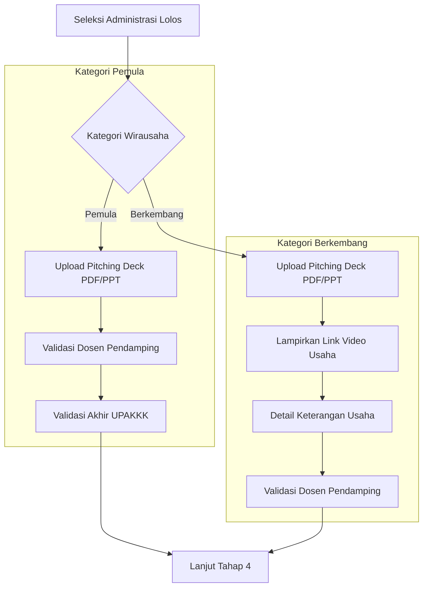

# 🚀 PMW DATA & DOCUMENT ENGINE

> [!IMPORTANT]
> Dokumen ini mendeskripsikan **Workflow Manual PMW Polsri** yang telah berjalan secara nyata di kampus sebelum aplikasi ini dikembangkan. Aplikasi ini berfungsi sebagai **Digital Layer** yang memfasilitasi, mengamankan, dan mengotomatisasi proses manual tersebut tanpa mengubah esensi bisnisnya.

---

## 🔄 OVERVIEW: THE 10-STAGE JOURNEY

Siklus hidup Program Mahasiswa Wirausaha (PMW) dibagi menjadi 11 tahapan krusial (10 tahap proses + 1 tahap penutupan).

| Tahap | Aktivitas Manual | Transformasi Digital | Status |
| :--- | :--- | :--- | :--- |
| **1** | Pendaftaran & Submit Proposal | Form Registrasi Digital, Tracking Status | ✅ Implemented |
| **2** | Seleksi Administrasi | Automated Checklist & Admin Flagging | ✅ Implemented |
| **3** | **Pitching Desk** | Dual-Category Upload & Peer Review | ✅ Implemented |
| **4** | Wawancara Perjanjian | Digital MoU & Record Hasil Wawancara | 🚧 In Progress |
| **5** | Pengumuman Tahap I | Multi-Channel Notifications (In-App/Email) | ✅ Implemented |
| **6** | Mentoring & Bimbingan | Log/Journal Digital & Absensi Verifikatif | ✅ Implemented |
| **7** | Monev Tahap 1 (Bazaar) | Evidence-Based Upload (Photos/Reports) | 📅 Planned |
| **8** | Monev Tahap 2 (Site Visit) | Digital Checklist with Field Verification | 📅 Planned |
| **9** | Pengumuman Tahap II | Final Funding Status Notifications | 📅 Planned |
| **10** | Laporan Akhir | Final Document Submission & Archiving | 📅 Planned |
| **11** | Awarding & Expo | Digital Certificates & Showcase Repository | 📅 Planned |

---

## 🎯 DEEP DIVE: TAHAP 3 (PITCHING DESK)

Tahap ini adalah filter krusial yang membedakan perlakuan terhadap profil usaha mahasiswa.

### 📊 Business Logic Flow

### 📋 Requirement Matrix per Kategori

| Aspek | Pemula | Berkembang |
| :--- | :--- | :--- |
| **Threshold** | Usaha baru/ide (< 1 tahun) | Usaha berjalan (≥ 1 tahun) |
| **Wajib Upload** | Pitching Deck | Deck + Video Link + Detail Bisnis |
| **Approval Path** | **2-Level**: Dosen -> UPAKKK | **1-Level**: Dosen Pendamping |
| **Fokus Utama** | Validasi Ide & Potensi | Validasi Progress & Growth |

---

## 👥 ROLE & PERMISSION ENGINE

Sistem harus secara ketat membedakan hak akses berdasarkan workflow nyata.

### 🛡️ Access Control Matrix
| Role | Action: Upload | Action: Verify | Insight: View |
| :--- | :--- | :--- | :--- |
| **Mahasiswa** | Proposal, Laporan, Nota | - | Progress Status & Feedback |
| **Admin** | Pengumuman, Jadwal | Administrasi & UPAKKK Approval | Full Audit Access (All Docs) |
| **Reviewer** | - | Scoring & Kelayakan | Submitted Proposals |
| **Dosen** | - | Log Bimbingan | Managed Students Progress |
| **Mentor** | - | Log Mentoring | Managed Students Progress |

---

## 🛠️ IMPLEMENTATION PATTERNS

### 1. Unified Document Security
Setiap akses ke dokumen tidak boleh melalui URL `public/`. Dokumen dilayani via `DocumentController` dengan validasi kepemilikan.
*   **Path**: `app/Controllers/DocumentController.php`
*   **Logic**: `isOwner() || isAdmin() || isAssignedReviewer()`

### 2. Dual-Mentoring Logic
Sistem memisahkan **Bimbingan** (Akademik/Dosen) dan **Mentoring** (Praktisi/Eksternal).
*   **Log Bimbingan**: Fokus pada administrasi dan kesesuaian panduan.
*   **Log Mentoring**: Fokus pada implementasi bisnis nyata di lapangan.

### 3. Context-Aware UI
Input field dan tombol aksi hanya muncul berdasarkan:
1.  **Fase Aktif** (Misal: Tombol upload LPJ tidak muncul di Fase Pendaftaran).
2.  **Kategori Wirausaha** (Misal: Input Video URL hanya muncul untuk 'Berkembang').

---

## 💡 THE CORE PHILOSOPHY
Aplikasi ini dirancang sebagai **Single Source of Truth** untuk UPAPKK Polsri. Setiap langkah digital meninggalkan jejak (audit trail) yang menggantikan tumpukan berkas fisik di sekretariat, memastikan proses seleksi yang lebih transparan dan akuntabel.
